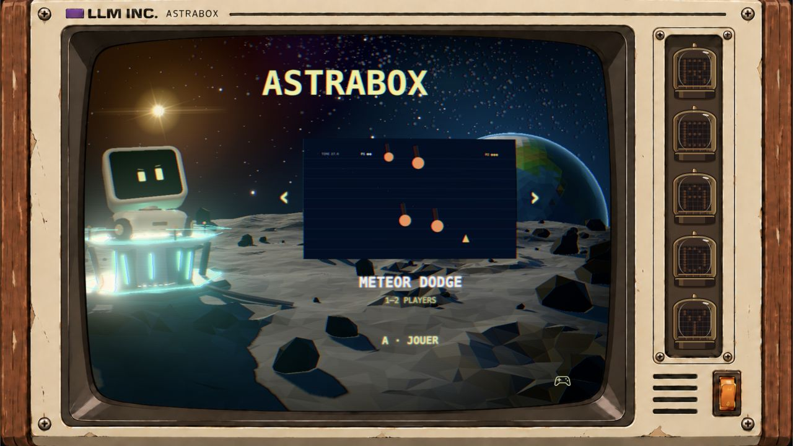
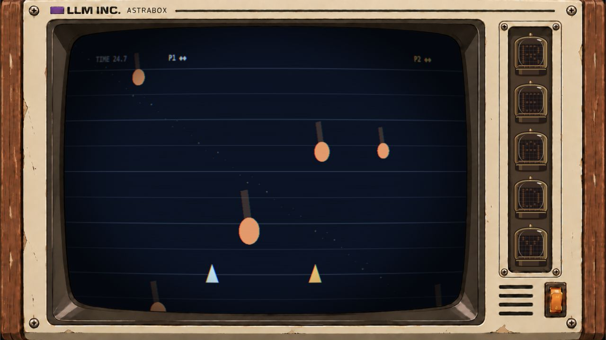
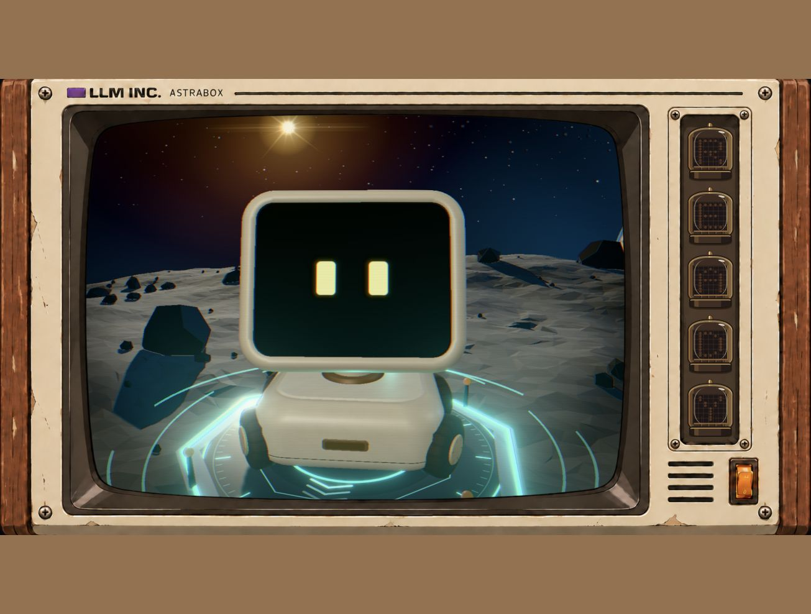

# ASTRABOX

**Create, play and reshape arcade games with Codex.**

ASTRABOX is a local game workshop with a lunar Three.js menu, a TV-headed robot,
independent PixiJS games and a shared arcade runtime. Describe a game by text or
voice, play it, then ask for changes while playing. Compatible edits preserve
the current match; larger changes may need a restart. Published changes stay on disk.



## Not just a cabinet

The software runs on a computer with Node.js and a WebGL2 browser. A Raspberry Pi
and a physical arcade cabinet are optional ways to use it, not requirements.
Keyboard, gamepad and USB arcade encoders share the same input layer.

This is an **experimental local-first release**, not a hosted game-generation service.
The native Codex voice integration is experimental and tied to the pinned CLI version.

## Quick start

Requirements: **Node.js 22 (22.13 or newer), or 24+**, npm, and a browser with WebGL2 and Web Audio.
Start with macOS or Linux; Windows has not been verified end to end.

```sh
git clone https://github.com/Qualzz/astrabox.git
cd astrabox
npm ci
npm start
```

Open **http://localhost:8080/**. The four included games work without a Codex login.
No kiosk, Raspberry setup or API key is needed to play them.

### Enable creation and editing

Sign in to the project's pinned Codex CLI on the machine running the server:

```sh
npx codex login
npx playwright install chromium
npm run doctor
```

The background Chromium installation is for post-publication smoke checks and
thumbnail rendering. It is not your game window and does not run continuously.
Generation uses your own Codex account and quota; access to the configured model
is required. ASTRABOX never copies your credentials into the browser or repository.

The default is **GPT-6 Astra · high · Fast**. Configure another model available to
your account without editing source code:

```sh
ASTRABOX_MODEL=your-model-id ASTRABOX_EFFORT=low npm start
```

`PORT` changes the local HTTP port. `CODEX_BIN` optionally replaces the pinned
CLI executable; protocol compatibility with a different version is not guaranteed.
Configuration uses process environment variables, not an automatically loaded `.env` file.
When using another port, set the CLI's `ARCADE_URL` to the matching localhost URL.

The integration keeps Codex App Server authentication for this local/open-source
application; see the [official authentication documentation](https://learn.chatgpt.com/docs/app-server#auth-endpoints).
ASTRABOX is not affiliated with or endorsed by OpenAI.

## Play

| Input | Player 1 | Player 2 |
| --- | --- | --- |
| Move | Arrow keys | W A S D |
| A / B | K / L | F / G |
| START | Enter | Space |

- Menus: left/right selects, **A confirms**, **B returns**. START also works.
- Hold either player's **START for 3 seconds** to leave a game. Escape is the keyboard shortcut.
- **C / CODEX** switches to the robot or toggles voice during a game. Voice does not lock gameplay.
- The controller icon on the menu opens persistent input mapping. There is no COIN requirement.
- `http://localhost:8080/?debug=1` exposes text requests and operator diagnostics.

Each cartridge owns its title screen, visuals, HUD, music and results. The framework
standardizes input, scores, replay, exit and player joining, not the artistic style.
Player 2 joining is game-specific: Meteor drops in immediately; Pong starts a versus match.



## Create or edit by text

With the server running, in another terminal on the **same host**:

```sh
node scripts/arcade.mjs list
node scripts/arcade.mjs new "Make a one-button arcade game about landing a spaceship."
node scripts/arcade.mjs edit line-pong "Make the paddles larger."
node scripts/arcade.mjs edit line-pong "Put them back as before."
node scripts/arcade.mjs status
```

Text and voice use the same harness. Each cartridge retains its conversation for
later edits; Remote is an input channel, not a second generator. A phone connected
to this host through Codex Remote can use the same commands. An ordinary ChatGPT
conversation does not automatically connect to this local server.

The central assistant receives the current menu/game context and can request a
fresh screen capture from an open client. New games get new identities; an edit
targets an existing one. Small compatible edits transfer the **current** state
between ticks, not an old snapshot from the start of the request.

Only one published copy per game is kept. `.arcade/` contains local conversation
metadata, preparation workspaces and thumbnail caches, not a version archive.
The READY tubes fill while work is active; publication confirms completion, not
the estimated one-minute animation.



## Project layout

```text
src/                  Browser runtime, input, audio, robot and CRT
  lunar/              Sky, Earth, Sun, terrain, platform and game selection
server/               Codex transport, context routing and cartridge publication
cartridges/           Four independent example games
prompts/              Instructions actually supplied to cartridge developers
assets/               Active display artwork, robot, MIDI and CC0 sound effects
art/robot/            Editable Blender source and procedural builder
deploy/raspberry-pi/   Optional host installation; no core dependency
docs/                 Architecture, cartridge contract, controls and Remote
tests/                Runtime and harness regressions
```

Learn more: [architecture](docs/ARCHITECTURE.md), [cartridge contract](docs/CARTRIDGE_CONTRACT.md),
[controls and voice](docs/USAGE.md), [Remote](docs/REMOTE.md),
[optional Raspberry Pi deployment](deploy/raspberry-pi/README.md).

## Development

```sh
npm run check
npm test
# Optional: install Chromium first, then include browser smoke tests.
npm run test:browser
```

`check` covers all JS syntax, undefined identifiers, browser import graphs and cartridge manifests.
Default tests do not call Codex or open browsers. Mock transport tests and browser
smoke tests do not prove a real voice conversation or complete gameplay quality.
See [release verification](docs/VERIFICATION.md) for what was actually exercised.

## Scope and data

- The server intentionally binds to **localhost**. Do not expose it to the internet.
- Cartridge isolation and static inspection are **not a security sandbox** for hostile code.
- Generated cartridges, conversations, logs and credentials are not part of this release.
- Highscores and control mappings live in the browser's local storage. Use the same browser
  and origin; `localhost` and `127.0.0.1` have separate storage.
- Voice needs microphone permission and browser audio activation; quality and availability
  depend on the native Codex service. No substitute speech service is silently used.

## License

Source and original project assets: [MIT](LICENSE). The selected Kenney sound effects
are **CC0**, with original attribution and license preserved. Third-party packages
and the OpenAI trademark have their own terms; see [third-party notices](THIRD_PARTY_NOTICES.md).

Contributions: [CONTRIBUTING.md](CONTRIBUTING.md).
